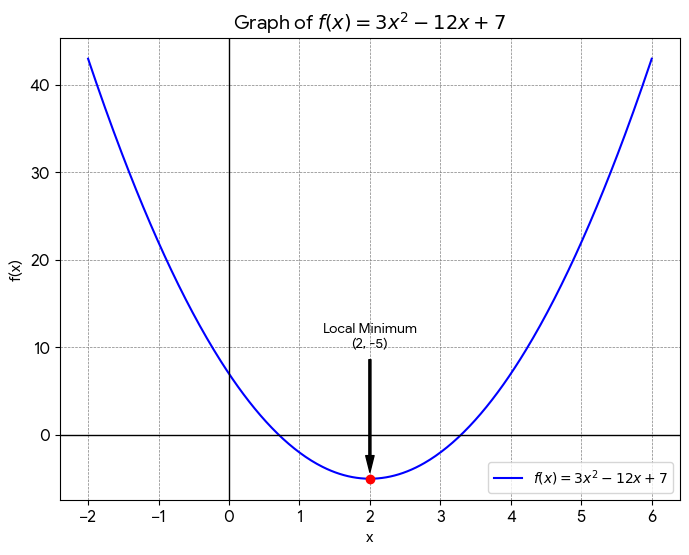

## 1. Vector Algebra

**Task:** Given two vectors in 3D space: $\vec{a} = [2, 1, -3]$ and $\vec{b} = [4, -2, 1]$. Calculate: a) The magnitude of each vector. b) The dot product $\vec{a} \cdot \vec{b}$. c) The cross product $\vec{a} \times \vec{b}$. d) The angle between vectors $\vec{a}$ and $\vec{b}$.

> **Governing Formulas:**
> * **Magnitude:** $|\vec{v}| = \sqrt{v_x^2 + v_y^2 + v_z^2}$
> * **Dot Product:** $\vec{a} \cdot \vec{b} = a_x b_x + a_y b_y + a_z b_z$
> * **Cross Product:** $\vec{a} \times \vec{b} = (a_y b_z - a_z b_y)\mathbf{i} - (a_x b_z - a_z b_x)\mathbf{j} + (a_x b_y - a_y b_x)\mathbf{k}$
> * **Angle:** $\theta = \arccos\left(\frac{\vec{a} \cdot \vec{b}}{|\vec{a}||\vec{b}|}\right)$
> 
> 

**Application:**

* **a) Magnitudes:**

$$|\vec{a}| = \sqrt{2^2 + 1^2 + (-3)^2} = \sqrt{14}$$

$$|\vec{b}| = \sqrt{4^2 + (-2)^2 + 1^2} = \sqrt{21}$$

* **b) Dot Product:**

$$\vec{a} \cdot \vec{b} = (2)(4) + (1)(-2) + (-3)(1) = 3$$

* **c) Cross Product:**

$$\vec{a} \times \vec{b} = \begin{vmatrix} \mathbf{i} & \mathbf{j} & \mathbf{k} \\ 2 & 1 & -3 \\ 4 & -2 & 1 \end{vmatrix} = -5\mathbf{i} - 14\mathbf{j} - 8\mathbf{k}$$

* **d) Angle:**

$$\theta = \arccos\left(\frac{3}{\sqrt{14}\sqrt{21}}\right) = \arccos\left(\frac{3}{7\sqrt{6}}\right) \approx 79.9^\circ$$

---

## 2. Systems of Equations

**Task:** Find the values of $x$ and $y$ that satisfy both equations: $2x + 3y = 12$ and $x - y = 1$.

> **Governing Formula (Substitution):**
> If $x - y = c$, then $x = y + c$.

**Application:**

$$x = y + 1$$

$$2(y + 1) + 3y = 12$$

$$5y = 10 \implies y = 2$$

$$x = 2 + 1 \implies x = 3$$

---

## 3. Proportionality

**Task:** Consider the Universal Law of Gravitation: $F = G \frac{m_1 m_2}{r^2}$, where $F$ is the gravitational force between two masses $m_1$ and $m_2$, $r$ is the distance between their centers, and $G$ is the gravitational constant. Determine the factor by which the force $F$ changes if the distance $r$ is *doubled* and both masses ($m_1$ and $m_2$) are *halved*.

> **Governing Formula:**
> $F \propto \frac{m_1 m_2}{r^2}$

**Application:**

$$F' = G \frac{(\frac{m_1}{2})(\frac{m_2}{2})}{(2r)^2}$$

$$F' = G \frac{\frac{m_1 m_2}{4}}{4r^2}$$

$$F' = \frac{1}{16} \left( G \frac{m_1 m_2}{r^2} \right) = \frac{1}{16} F$$

---

## 4. Rearranging Formulas

**Task:** The formula for the period of a simple pendulum is $T = 2\pi \sqrt{\frac{L}{g}}$. Rearrange the equation give a formula for $g$ (acceleration due to gravity).

> **Goal:**
> Isolate $g$ from $T = 2\pi \sqrt{\frac{L}{g}}$

**Application:**

$$\frac{T}{2\pi} = \sqrt{\frac{L}{g}}$$

$$\left(\frac{T}{2\pi}\right)^2 = \frac{L}{g}$$

$$g = \frac{L}{\left(\frac{T}{2\pi}\right)^2} = \frac{4\pi^2 L}{T^2}$$

---

## 5. Trigonometry

**Task:** A vector $\vec{A}$ has a magnitude of 15 and makes an angle of $\theta = 60^\circ$ with the horizontal axis. Calculate its horizontal and vertical components.

> **Governing Formulas:**
> * **Horizontal:** $A_x = A \cos(\theta)$
> * **Vertical:** $A_y = A \sin(\theta)$
> 
> 

**Application:**

$$A_x = 15 \cos(60^\circ) = 15 \left(\frac{1}{2}\right) = 7.5$$

$$A_y = 15 \sin(60^\circ) = 15 \left(\frac{\sqrt{3}}{2}\right) = 7.5\sqrt{3}$$

---

## 6. Function Analysis

**Task:** Consider the function $f(x) = 3x^2 - 12x + 7$. Identify any local maxima or minima.

> **Governing Formulas:**
> Critical points occur where the first derivative is zero: $f'(x) = 0$.

**Application:**

$$f(x) = 3x^2 - 12x + 7$$

$$f'(x) = 6x - 12 = 0$$

$$x = 2$$

$$f(2) = 3(2)^2 - 12(2) + 7 = -5$$

**Result:** Local minimum at $(2, -5)$.

---

## 7. Logic & Series

**Task:** A bicycle is 10 meters from a wall and moves towards it at a constant speed of 1 m/s. A fly starts from the bicycle's front wheel and flies towards the wall at 2 m/s. When it hits the wall, it instantly turns back and flies to the bicycle, and so on. What is the total distance the fly travels before being crushed?

> **Governing Formulas:**
> * **Time:** $t = \frac{d}{v}$
> * **Total Distance:** $d_{\text{total}} = v_{\text{fly}} \cdot t$
> 
> 

**Application:**

$$t = \frac{10}{1} = 10 \text{ s}$$

$$d_{\text{fly}} = 2 \cdot 10 = 20 \text{ m}$$

---

## 8. Definite Integrals

**Task:** Calculate the area under the curve of the function $f(x) = \sin(x)$ from $x=0$ to $x=\pi$.

> **Governing Formula:**
> $\int \sin(x) \, dx = -\cos(x) + C$

**Application:**

$$\int_{0}^{\pi} \sin(x) \, dx = [-\cos(x)]_{0}^{\pi}$$

$$= -\cos(\pi) - (-\cos(0))$$

$$= -(-1) - (-1) = 2$$

---

## 9. Optimization Problem

**Task:** A rectangle is under the curve $y = 3 - x^2$ in the first quadrant. What are the dimensions of the rectangle with the maximum area?

> **Governing Formulas:**
> * **Area:** $A = x \cdot y$
> * **Optimization:** Set $\frac{dA}{dx} = 0$.
> 
> 

**Application:**

$$A = x(3 - x^2) = 3x - x^3$$

$$\frac{dA}{dx} = 3 - 3x^2 = 0$$

$$x^2 = 1 \implies x = 1$$

$$y = 3 - (1)^2 = 2$$

**Result:** Dimensions are $1 \times 2$.

---

## 10. Infinite Series

**Task:** Determine the final position of an ant that starts at the origin and moves according to the following pattern: 1 m east, 1/2 m north, 1/3 m west, 1/4 m south, 1/5 m east, and so on.

> **Governing Formulas:**
> * **Arctangent Series:** $\arctan(z) = z - \frac{z^3}{3} + \frac{z^5}{5} - \dots$
> * **Alternating Harmonic Series:** $\ln(1+z) = z - \frac{z^2}{2} + \frac{z^3}{3} - \dots$
> 
> 

**Application:**

$$x = 1 - \frac{1}{3} + \frac{1}{5} - \frac{1}{7} + \dots = \arctan(1) = \frac{\pi}{4}$$

$$y = \frac{1}{2} - \frac{1}{4} + \frac{1}{6} - \frac{1}{8} + \dots = \frac{1}{2} \left(1 - \frac{1}{2} + \frac{1}{3} - \frac{1}{4} + \dots\right) = \frac{1}{2}\ln(2)$$

**Result:** Final position is $\left(\frac{\pi}{4}, \frac{\ln(2)}{2}\right)$.
